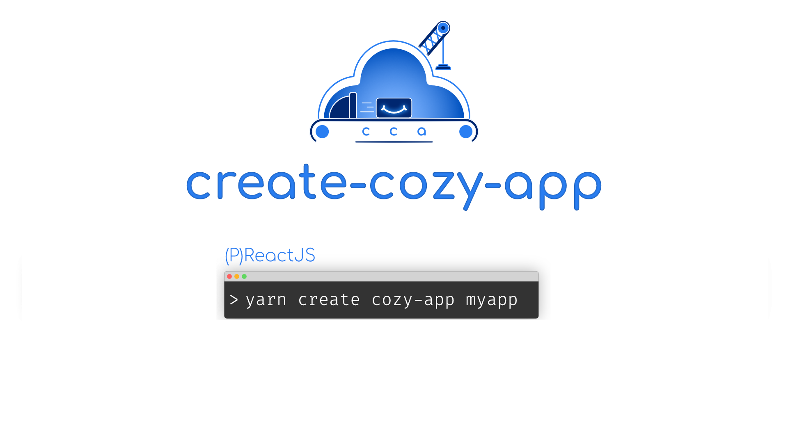

<div align="center">
  
</div>

<h1 align="center">Create Cozy App</h1>

<div align="center">
  <a href="https://github.com/cozy/create-cozy-app/blob/master/packages/create-cozy-app/LICENSE">
    
  </a>
  <a href="https://travis-ci.org/cozy/create-cozy-app">
    
  </a>
  <a href="https://renovateapp.com/">
    
  </a>
  <a href="https://github.com/facebook/jest">
    
  </a>
</div>

<p align="center">Start quickly your Cozy application</p>

### What's create-cozy-app?

`create-cozy-app` is a command line tool that creates a skeleton of an application for Cozy, using Cozy libraries.

This tool can be run as an installed CLI or by using `yarn create`, see below for more information.

By default, `create-cozy-app` will use the [`cozy-scripts`](https://github.com/cozy/create-cozy-app/tree/master/packages/cozy-scripts) scripts bundle to build your app based on React.

__You can find a complete tutorial about creating a Cozy application using `create-cozy-app` in [the official documentation (docs.cozy.io)](https://docs.cozy.io/en/tutorials/app/).__


#### Requirements

 - NodeJS version 20+
 - [Yarn](https://yarnpkg.com): a NodeJS package manager, like `npm`;
 - a running [Cozy development environment](https://docs.cozy.io/en/tutorials/app/#install-the-development-environment)


### Bootstrap an application

You can use `create-cozy-app` without installing it globally using `yarn create`
([yarn create documentation](https://yarnpkg.com/lang/en/docs/cli/create/)):

```
yarn create cozy-app mycozyapp
```

<details>
  <summary>
    You can also install the package globally.

  </summary>

```
yarn global add create-cozy-app
create-cozy-app mycozyapp
```

⚠️ By using a locally installed CLI, you will have to update it regularly to keep the app
template up to date. It is why we recommend to use directly `yarn create` which will always uses
the latest version of the CLI.

</details>

It will

* download dependencies (it may take a while, you can go grab a coffee)
* ask you a few questions
* then create an application skeleton inside `mycozyapp`.

### Start developing

ℹ️ See [this tutorial](https://docs.cozy.io/en/tutorials/app/) for more information on
how to develop a cozy-app. Below, you'll find just the essential.

You can start developing with:

```
cd mycozyapp
yarn start
```

This starts a `webpack-dev-server` that continuously builds the application
into the `build` folder.

If not already started, you should start a `cozy-stack` serving this folder:

```bash
touch ~/cozy.yaml # You can edit this file to configure the stack
docker run -ti --rm -p 8080:8080 -p 5984:5984 -p 8025:8025 -v (pwd)/build:/data/cozy-app/mycozyapp -v ~/cozy.yaml:/etc/cozy/cozy.yaml cozy/cozy-app-dev
```

You app should now be available at `http://mycozyapp.cozy.tools:8080`.


### Options

##### `--scripts-source` (useful for hacking)

You can pass a custom scripts package using the optional `--scripts-source` option, it can be one of:

- a __relative local path__ to a tarball (`fileRel:` prefix): `fileRel:./a-folder/my-cozy-scripts.tar.gz`
- an __absolute local path__ to a tarball (`fileAbs:` prefix): `fileAbs:/root/my-cozy-scripts.tar.gz`
- an __URL__ to a tarball (`url:` prefix): `url:https://myurl.com/my-cozy-scripts.tar.gz`
- a specific __npm version__ (`version:` prefix): `version:0.1.5`
- a specific __git commit/branch__ with name provided after the '#' (`git:` prefix): `git://github.com/cozy/cozy-scripts.git#master`

##### `--verbose`

Using this options, `create-cozy-app` will be run in a more verbose way, useful for debugging or understanding what the script does.


## Community

### What's Cozy?

<div align="center">
  <a href="https://cozy.io">
    
  </a>
 </div>
 </br>

[Cozy] is a platform that brings all your web services in the same private space.  With it, your webapps and your devices can share data easily, providing you with a new experience. You can install Cozy on your own hardware where no one's tracking you.

### Get in touch

You can reach the Cozy Community by:

- Chatting with us on IRC `#cozycloud` on [Libera.Chat][libera]
- Posting on our [Forum][forum]
- Posting issues on the [Github repos][github]
- Say Hi! on [Twitter][twitter]


## License

`create-cozy-app` is distributed under the MIT license.

CCA logo by [@CPatchane](https://github.com/CPatchane).


[cozy]: https://cozy.io "Cozy Cloud"
[libera]: https://web.libera.chat/#cozycloud
[forum]: https://forum.cozy.io/
[github]: https://github.com/cozy/
[twitter]: https://twitter.com/cozycloud
