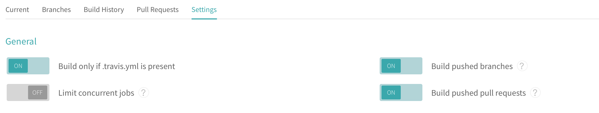
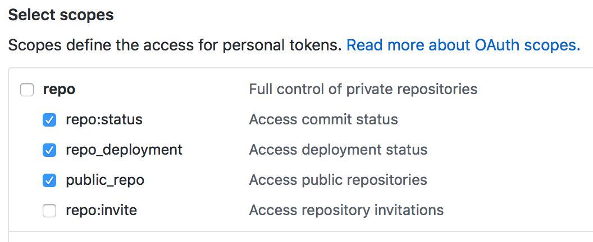

# Build automatically your app using Travis CI

When you bootstrap your app using `cozy-scripts`, this latter will include a `.travis.yml` config file which will allow you to build automatically your application using [Travis CI](https://travis-ci.org).

The only one thing you have to do is to generate a Github token in order to push back your build to a dedicated branch. You can follow these steps if you want to enable that behavior:

- On your [travis-ci.org](https://travis-ci.org) account, find your project name (should be the same than the Github repository of your application) and enable Travis by using the related checkbox 
- Once enabled, go to this project on Travis by clicking on it and then go to the "Settings" menu by using the "More options" menu at the top right.
- Enable these three options (not mandatory but highly recommended):
    - "Build only if .travis.yml is present"
    - "Build branch updates" (run Travis after each branch update)
    - "Build pull request updates" (run Travis after each Pull Request update)

- Then, you have to generate a Github token in [your Github account settings](https://github.com/settings/tokens). Here is [a Github blog post about API token](https://blog.github.com/2013-05-16-personal-api-tokens/) if you need more informations. The token here will only be used to push back your application build files to your repository. So, you should only have to authorize the access to the 'repo scope' like following: 
- Finally, you can add this token as an __ECRYPTED TRAVIS VARIABLE__ by using the [`travis` utility](https://github.com/travis-ci/travis.rb#installation) and your repository name:
```shell
travis encrypt GITHUB_TOKEN=YourGeneratedToken --add -r myGithubName/my-app --org
```

> :warning: __Important :warning: :__ It's highly recommended to __encrypt all your Travis global variables__ like previously in order to keep your Github token secret and never push it as 'plain-text'. If you made a mistake, don't hesitate to revoke the token and generate a new one as quickly as possible using [the Gihthub settings interface](https://github.com/settings/tokens).

Commit and publish this `.travis.yml` file change to your repository and you're done. You can now enjoy seeing Travis builds automatically your application :tada:

## Why push back my build on a dedicated branch?

The Cozy platform only needs your application build files (the final `html`, `css` and `js` and assets files from webpack) to be installed and you don't have to provide all your source code. So, it's more useful to have your source code on your main branch like `master` and all your builds (automatically) on a branch like `build` for example.

In this way, when we install an application on a Cozy, we use directly `git://github.com/myName/my-app.git#build`.
